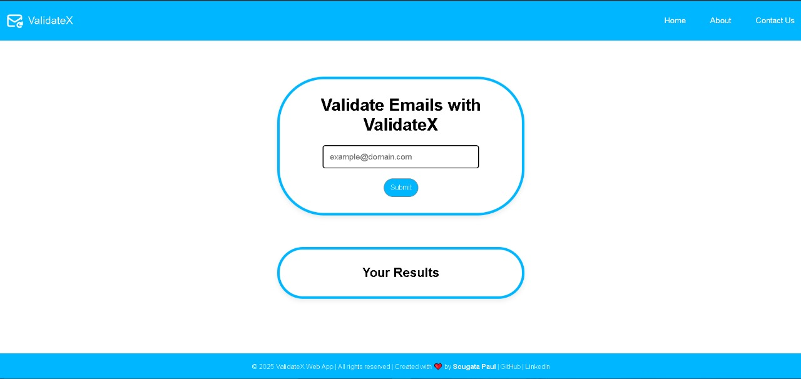
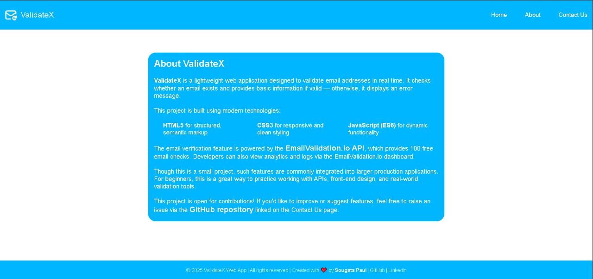

# 📧 ValidateX - Email Validator Web App

ValidateX is a lightweight and user-friendly web application that checks the validity of email addresses in real time. It helps you identify whether an email address actually exists or is likely fake, using the [EmailValidation.io](https://emailvalidation.io) API.

---

## 🌐 Live Demo

[🔗 Click here to try ValidateX](https://validatex-izu1imclk-sougata-pauls-projects.vercel.app/index.html) 

---

## 🚀 Features

- ✅ Real-time email validation
- 🧠 Tells whether an email exists or not
- 🔍 Displays basic details for valid emails
- 📉 Error handling for invalid addresses
- 📬 Clean and responsive UI
- 💡 Beginner-friendly HTML5, CSS3, and JavaScript
- 🔐 Powered by [EmailValidation.io](https://emailvalidation.io)
- 📖 Includes a detailed **About** page that explains the project, its technologies, API usage, and contribution guidelines  
  ([View on GitHub](https://github.com/Sougata2006)) 

---

## 🛠️ Tech Stack

- **HTML5** – For semantic structure  
- **CSS3** – For beautiful and responsive design  
- **JavaScript (ES6)** – For interactivity and API handling  
- **[EmailValidation.io](https://emailvalidation.io)** – To verify emails 

---

## 📂 Project Structure

```bash
ValidateX/
├── index.html              
├── about.html              
├── style.css             
├── script.js         
├── LICENSE                
├── README.md             
├── images/                
    ├── logo.svg         
    ├── home.jpg        
    ├── about.jpg        
    └── loading.svg         
```
---

## 🖼️ Screenshots

- ### Home


- ### About


---

## 🤝 Contributing

Have an idea to improve this project?  
You're welcome to contribute!  

- Fork this repository
- Make your changes
- Raise an issue or a pull request


---

## 📄 License

This project is licensed under the **MIT License** – see the [LICENSE](LICENSE) file for details.

---

> © 2025 **ValidateX** | Created by **Sougata Paul**
